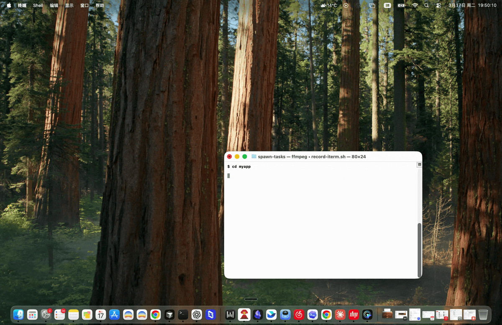
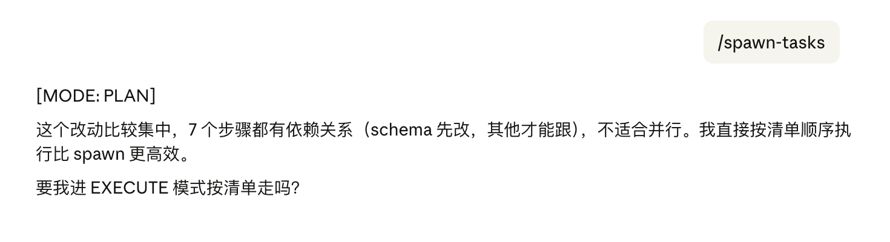

# spawn-tasks

A [Claude Code](https://claude.ai/code) skill that spawns parallel Claude Code sessions from planned subtasks. Each session gets its own git worktree with full task context. Automatically detects the environment and chooses the best spawning method — tmux panes in terminal, or background Agent workers in desktop apps.



## What it does

After you break down a project into subtasks in a Claude Code conversation, `/spawn-tasks` will:

1. Write self-contained task files to `.tasks/spawn/` in your project
2. Auto-detect the environment and spawn sessions using the best available method
3. Each session gets its own isolated git worktree — no conflicts between parallel sessions

## Smart spawning

`/spawn-tasks` doesn't blindly parallelize. Before spawning, Claude analyzes the task dependencies. If the tasks are sequential (e.g. schema changes must land before other work can follow), it will say so and recommend running them in order instead.



Only truly independent tasks get spawned in parallel.

## Installation

Copy `SKILL.md` into your Claude Code skills directory:

```bash
mkdir -p ~/.claude/skills/spawn-tasks
cp SKILL.md ~/.claude/skills/spawn-tasks/SKILL.md
```

Or clone this repo directly:

```bash
git clone https://github.com/theradengai/spawn-tasks ~/.claude/skills/spawn-tasks
```

## Usage

1. In a Claude Code session, plan and confirm your subtasks with Claude
2. Run `/spawn-tasks`
3. Claude will show you the task list and ask for confirmation before spawning
4. Sessions are spawned automatically using the best method for your environment

## Environment auto-detection

| Environment | Method | How it works |
|---|---|---|
| Terminal (iTerm2, Terminal.app, etc.) | tmux panes | `claude -w <name> --tmux` — real-time visibility, switch panes with Ctrl+B |
| Desktop app / IDE terminal | Agent workers | Background agents with worktree isolation — results reported on completion |

Detection is automatic (`test -t 0`). No configuration needed.

## Requirements

- [Claude Code](https://claude.ai/code) CLI (`claude`)
- A git repository (worktrees require git)
- tmux (optional, for terminal pane mode)

## How sessions are isolated

Each spawned session uses `claude -w <task-name>`, which creates a separate git worktree for that task. This means:

- Each session works on its own branch
- File edits don't conflict between sessions
- Sessions can run truly in parallel

## Task file format

Each task gets a file at `.tasks/spawn/{task-name}.md`:

```markdown
# Task: {task name}

## Goal
{what this subtask should accomplish}

## Context
{architectural background, dependencies, related modules}

## Relevant Files
{list of key file paths}

## Constraints
{consensus docs to follow, technical limitations, things to avoid}

## Acceptance Criteria
{how to verify the task is complete}
```

The task file is passed as the initial prompt to the spawned session, so it must be fully self-contained.

## License

MIT
